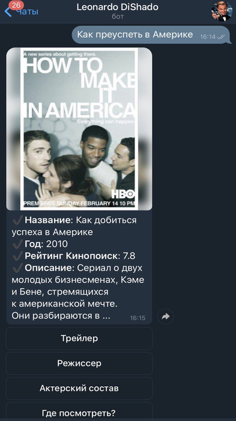

# Leonardo DiShado

Телеграм-бот @leo_deshado_bot для поиска информации о фильмах, а также платформ для их просмотра.
    
## Использование

Интерфейс бота максимально прост: пользователь вводит название фильма или сериала, 
который его интересует. В ответ пользователю в случае успешного поиска приходит информация о фильма в виде постера, 
оригинального названия, года премьеры и краткого описания. Было не решено не выводить всю информацию, 
чтобы не перегружать пользователя.

Для того, чтобы получить дополнительную информацию, необходимо выбрать 
соответствующий пункт из кнопок: трейлер, режиссер, актеский состав и ссылка на просмотр.

После того, как пользователь получил необходимую информацию по текущему фильму, он может ввести 
название другого и продолжить использование.

Настоятельно рекомендую попробовать кнопку "Блог" снизу (обожаю пасхалки).

Также бот поддерживает 2 команды: /start - для начала беседы и /help для помощи пользователю.

## Реализация

Бот реализован на базе библиотеки aiogram. Для сетевых взаимодействий используется aiohttp.

Поиск информации происходит в 2 этапа:

- Запрос в поисковик компании, которую не принято называть, фразы <фраза пользователя в диалоге> + "фильм".
 Среди поисковой выдачи происходит поиск ссылки на кинопоиск, откуда извлекается id соответствующего фильма. 
 Также по ключевым словам (просмотр, онлайн, смотреть) происходит поиск ссылки на онлайн-кинотеатры с этим фильмом.
- По найденному id происходит запрос в API кинопоиска, откуда мы получаем остальную информацию

В качестве побочной фичи с использованием поисковика пришло то, что названия можно набирать неточно. 
Также можно даже сделать запрос описательного характера. Например, 
на запрос "фильм про человека ученого с собакой апокалипсис" вернется 
информация на фильм "Я - легенда".

API g**gle search: https://rapidapi.com/apigeek/api/google-search3
API кинопоиск: https://kinopoisk.cloud

## Авторы и благодарности

  - **Медведев Игорь** - *Автор проекта*
  - **Команда преподавателей курса Python в ШАД**
  - **Леонардо Ди Каприо** - идейный вдохновитель.
  - **BotFather** - пришлось просил его создать бота, и делать это с уважением.

## Дополнительно

Мы не в коим случае не поддерживаем пиратство и призываем осуществлять 
просмотр только легального контента.
